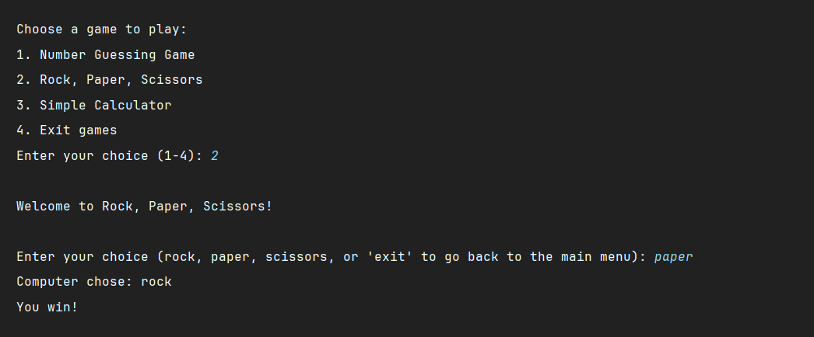

# 🎉 Fun Games Collection 🎮


Welcome to the Fun Games Collection! This repository contains three fun and simple games you can play from your
terminal: Number Guessing Game, Rock, Paper, Scissors, and a Simple Calculator. Enjoy playing and feel free to
contribute!

## Games Included

1. 🔢 Number Guessing Game: Guess a randomly generated number between 1 and 100.
2. ✂️📄🪨 Rock, Paper, Scissors: Play the classic game against the computer.
3. 🧮 Simple Calculator: Perform basic arithmetic operations.

## How to Play

### 🔢 Number Guessing Game

The goal is to guess a randomly selected number between 1 and 100. The game will give you hints whether your guess is
too high or too low. Keep guessing until you find the correct number.

#### To Play:

1. Select the Number Guessing Game from the main menu.
2. Enter your guesses.
3. Type exit to return to the main menu.

### ✂️📄🪨Rock, Paper, Scissors

Play the classic game against the computer. Enter your choice and see if you can beat the computer.

#### To Play:

1. Select Rock, Paper, Scissors from the main menu.
2. Enter rock, paper, or scissors.
3. Type exit to return to the main menu.

### 🧮 Simple Calculator

Perform basic arithmetic operations (addition, subtraction, multiplication, division).

#### To Play:

1. Select Simple Calculator from the main menu.
2. Enter your arithmetic expression in the format number1 operator number2 (e.g., 3 + 4).
3. Type exit to return to the main menu.

## Getting Started

### Prerequisites

Ensure you have Python installed on your system. You can download it from [python.org](https://www.python.org).

### Installation

1. Clone the repository:

```sh
git clone https://github.com/ayubxontursunov/Fun-games-collection.git
cd fun-games-collection
```

2. Run the game collection:

```sh
python games.py
```

## Code Structure

- `games.py`: The main script containing all the game functions and the main menu.

## License

This project is licensed under the MIT License. See the `LICENSE` file for details.

## Acknowledgements

Thank you to everyone who contributes to this project. Your efforts make this a fun and educational experience for all.

## Screenshot 📸

[//]: # (![Certificate Example]&#40;data/result.png&#41;)



#### Enjoy playing the games and happy coding! 🎮🎉😊

